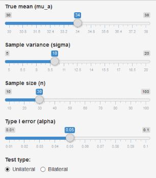

## What is power?

The power of a hypothesis test is the is the probability that the test correctly rejects the null hypothesis. The power of a hypothesis test is affected by:

- the sample size ($n$),
- the difference between the value under the null hypothesis and the real value  ($\mu_a-\mu_0$),
- the variability of the data ($\sigma$),
- the significance level of the test ($\alpha$).

If a test has low power, you might fail to detect an effect and mistakenly conclude that none exists.
If a test has power that is too high, very small and possibly uninteresting effects might seem to be significant. 

No test is perfect: there is always the possibility that the results of a test will lead you to reject the null hypothesis ($H_0$) when it is actually true (a type I error) or to fail to reject $H_0$ when it is actually false (a type II error).

--- .class #id 

## The ShinyPower App

The ShinyPower app is an interactive visualisation of the power of a hypothesis test.

The controls in the sidebar allow you to change the values of the parameters that affect the power.




--- .class #id 

## Usage

To visualize the value of the power of your test hypothesis, simply play with the controls in the sidebar. Each time you modify a value, the plot is updated and the value of the power is calculated. Try to change the sample size, real mean value, the variability and the significance level and observe the blue area under the blue normal curve (the real distribution)


```r
n=30; mu0=30; mua=34; alpha=0.05; sd=10.0/sqrt(n);  zcrit2=mu0+qnorm(1-alpha)*sd
(power = round(pnorm(zcrit2,mua,sd,lower.tail=FALSE),3))
```

```
## [1] 0.707
```

If we really want detect a mean of 34 (rejecting $H_0:\mu=30$ ), we need a greater sample size:


```r
n=60; sd=10.0/sqrt(n);  zcrit2=mu0+qnorm(1-alpha)*sd
(power = round(pnorm(zcrit2,mua,sd,lower.tail=FALSE),3))
```

```
## [1] 0.927
```

--- .class #id 

## Why Power is important

$\alpha$ is the probability of making a Type I error when $H_0$ is true. The acceptable Type I error rate is set before running the study. Before we collect our data we should perform a power analysis. Usually we specify **the minimum size effect we are interested in finding**, set $\alpha$ to 0.05 and $\beta$ to 0.1 (i.e. 90% power). The power analysis will tell us **how large** our sample needs to be to achieve this power and **correctly reject** the null hypothesis.

### Credits

Understanding Statistical Power and Significance Testing (http://rpsychologist.com/d3/NHST/)

Stat Trek (http://stattrek.com/hypothesis-test/power-of-test.aspx?Tutorial=AP)

Wikipedia (https://en.wikipedia.org/wiki/Statistical_power)

Minitab Express Support (http://support.minitab.com/en-us/minitab-express/1/help-and-how-to/basic-statistics/inference/supporting-topics/basics/increase-the-power-of-a-hypothesis-test/)

<style>
strong {
  font-weight: bold;
}
em {
  font-style: italic;
}
</style>
